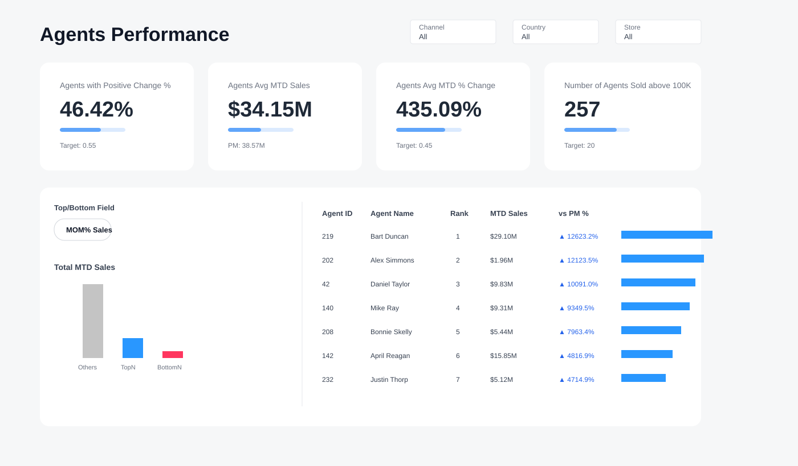

# Agents Performance Dashboard

Power BI portfolio project focused on **dashboard development, Power Query debugging, data quality, and root-cause analysis**.



## What the dashboard analyzes

- Agents with positive month-over-month change
- Average MTD sales by agents
- Average MTD % change
- Number of agents with sales above 100K
- Top / Bottom agent analysis
- Filters by channel, country/period, and store

## Troubleshooting cases

### 1. FactSales — DateKey parsing and key naming
**Problem:** refresh errors were caused by inconsistent key capitalization and `DateKey` values stored as `dd.MM.yyyy` being interpreted with the wrong locale.

**Fix:** standardized key names, cleaned headers, detected the delimiter, and explicitly parsed `DateKey` as `dd.MM.yyyy`.

### 2. DimStore — missing StoreKey
**Problem:** the CSV used `;` as the delimiter while the query expected `,`. Power Query loaded the full row into one column, so `StoreKey` did not exist as a separate field.

**Fix:** changed the delimiter to `;` and used safer column-removal logic with `MissingField.Ignore`.

### 3. DimEmployee — EmployeeKey load error
**Problem:** the query failed when the expected `EmployeeKey` schema did not match the imported structure.

**Fix:** added delimiter detection, header cleaning, case-insensitive column-name normalization, safer date conversion, and type conversion only for columns that exist.

## Skills demonstrated

Power BI · Power Query (M) · Data Cleaning · CSV Troubleshooting · Date/Locale Handling · Schema Validation · Data Modeling · Root-Cause Analysis · Dashboard Debugging

## Repository structure

```text
Agents-Performance-Dashboard/
├── README.md
├── dashboard-preview.svg
└── PowerQuery/
    ├── FactSales_Original_Query.pq
    ├── FactSales_Fixed_Query.pq
    ├── DimStore_Original_Query.pq
    ├── DimStore_Fixed_Query.pq
    ├── DimEmployee_Original_Query.pq
    └── DimEmployee_Fixed_Query.pq
```

The original/fixed query pairs document the debugging process instead of showing only the final result.
